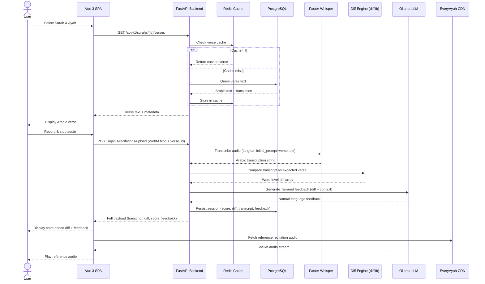

# System Architecture

## Overview
The Tajweed Recitation Coach follows a three-tier client-server architecture paired tightly with a dedicated, **fully local** AI processing pipeline. Each layer is independently deployable and scalable while maximizing data privacy.

### Architecture Layers
- **Tier 1 — Presentation:** Vue 3 SPA (Vite build, Tailwind CSS)
- **Tier 2 — Application:** Python FastAPI REST backend
- **Tier 3 — Data:** PostgreSQL (relational) + Redis (cache and queue mechanisms)
- **AI Layer (Local):** Faster-Whisper (offline STT) + Ollama (offline LLM feedback generation)
- **External Dependencies:** EveryAyah.com (free audio CDN)

## Component Responsibilities

| Component | Technology | Responsibility |
| --- | --- | --- |
| **Frontend SPA** | Vue 3 + Vite + Tailwind | UI rendering, audio capture via WebAudio, state management via Pinia |
| **API Gateway** | FastAPI Python 3.11 | REST endpoints, request routing |
| **STT Processor** | Faster-Whisper | Offline Arabic audio-to-text transcription |
| **Feedback Engine** | Ollama API | Natural language feedback generation generated purely on-device |
| **Diff Engine** | Python difflib | Word-level comparison of user transcription vs correct verse text |
| **Database** | PostgreSQL 15 | Users, sessions, practice history, verse metadata |
| **Cache** | Redis 7 | Verse text cache, session store, potential message brokering |
| **Reference Audio** | EveryAyah CDN | Auto-failover sheikh recitation audio fetched per verse on demand |

## Core Recitation Request Flow

1. **Verse Select:** The user selects a Surah and Ayah from the dropdown.
2. **Verse Fetch:** Vue issues a GET request for verse text/metadata. FastAPI queries PostgreSQL/Redis and returns Arabic text alongside the English translation.
3. **Capture:** The user clicks Record, speaks, and hits stop. Vue captures the stream as an audio blob.
4. **Processing Pipeline:**
   - FastAPI passes the audio chunk strictly to the localized **Faster-Whisper** engine for transcription (`language="ar"`).
   - FastAPI compares Faster-Whisper's output to the strictly correct Quranic text via the **Diff Engine**.
   - FastAPI packages the diff JSON and contextual prompt, sending it to the host machine's running **Ollama HTTP API**.
5. **Persistence:** FastAPI persists the computed accuracy score, the stringified diff map, the raw transcript, and the LLM feedback back to PostgreSQL.
6. **Delivery:** The structured payload is bounced back to Vue.
7. **Listening Session:** Vue displays the color-coded UI diff, the human-readable text guide, and automatically queues up the `ReferencePlayer.vue` fetching directly from EveryAyah.

## Data Model

The baseline database topology is highly structured around four core relational tables:

### 1. `users`
- `id` (UUID): Auto-generated identifier
- `email` (VARCHAR): Unique login handle
- `password_hash` (VARCHAR): Bcrypt payload

### 2. `surahs`
- `id` (INTEGER / PK): Surah number `1` to `114`
- `name_arabic` (VARCHAR): Native Uthmani rendering
- `name_english` (VARCHAR): Transliterated title
- `ayah_count` (INTEGER): Total depth of surah

### 3. `verses`
- `id` (INTEGER / PK)
- `surah_id` (INTEGER / FK): Connects via foreign key mapping to parent `surahs`
- `ayah_number` (INTEGER): Sequential numbering 
- `text_arabic` (TEXT): Core Uthmani string
- `text_english` (TEXT): Translation data

### 4. `recitation_sessions`
- `id` (UUID / PK)
- `user_id` (UUID / FK)
- `verse_id` (INTEGER / FK)
- `transcription` (TEXT): What Faster-Whisper heard out loud
- `accuracy_score` (FLOAT): `0.0` - `1.0` edit-distance ratio multiplier
- `feedback_text` (TEXT): Raw AI critique sent via Ollama
- `diff_json` (JSONB): Mapped array of array states (correct/incorrect arrays)
